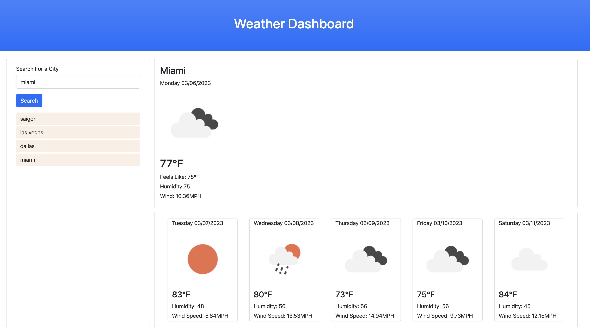

# Weather-Dashboard

This project utilizes JavaScript and and the [Open Weather API](https://openweathermap.org/) to create a weather dashboard. In addition, it uses [Geolocation API](https://developer.mozilla.org/en-US/docs/Web/API/Geolocation_API) to get the user's current location an return current location's weather. [Bootstrap](https://getbootstrap.com/) and [DayJs](https://day.js.org/en/) are used for styling and date formatting.

It solves the following acceptance criterias:

## GIVEN a weather dashboard with form inputs

- WHEN I search for a city
THEN I am presented with current and future conditions for that city and that city is added to the search history

- WHEN I view current weather conditions for that city
THEN I am presented with the city name, the date, an icon representation of weather conditions, the temperature, the humidity, and the wind speed

- WHEN I view future weather conditions for that city
THEN I am presented with a 5-day forecast that displays the date, an icon representation of weather conditions, the temperature, the wind speed, and the humidity

- WHEN I click on a city in the search history
THEN I am again presented with current and future conditions for that city

### Screenshot of the project

### Link to deployed site

[Work Day Scheduler](https://ericnguyen23.github.io/Weather-Dashboard/)
